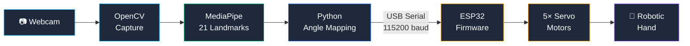
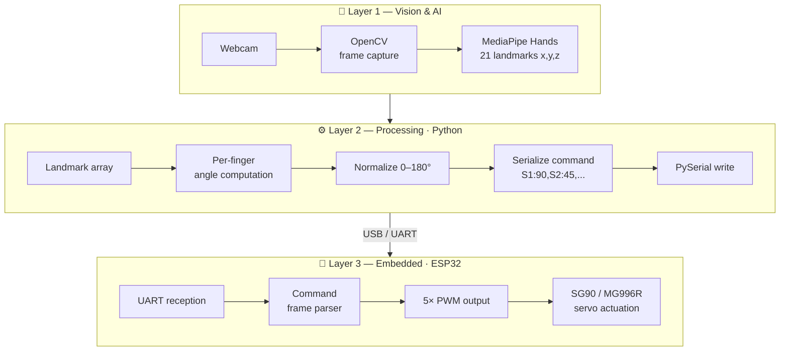
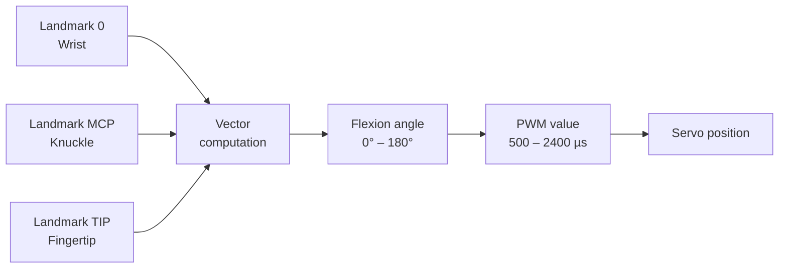
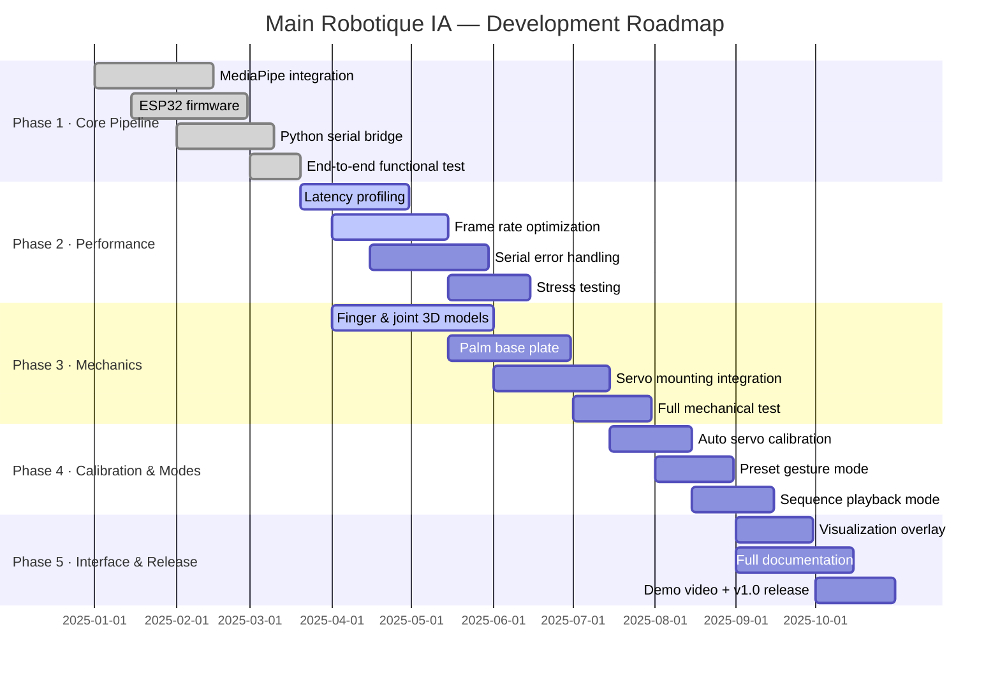

<div align="center">

# Main Robotique IA

**Open-source robotic hand controlled by real-time AI hand tracking**

[](.)
[](.)
[](.)
[](.)
[](.)
[](.)

</div>

---

## Overview

**Main Robotique IA** is a fully functional robotic hand that replicates human finger movements in real time using a standard webcam and AI-based hand tracking.

A camera captures the user's hand. MediaPipe detects 21 3D landmarks on it. Python computes the flexion angle of each finger and sends the result to an ESP32 microcontroller over USB serial. The ESP32 drives five servo motors — one per finger — to mirror the gesture with minimal latency.

No cloud. No external API. Everything runs locally on consumer hardware.

> **Current state:** the full pipeline is operational end-to-end. The hand successfully replicates gestures captured by the camera in real time. Active work is focused on latency reduction, mechanical refinement, and auto-calibration.

---

## Demo

| Gesture captured | Hand response |
|-----------------|---------------|
| Open hand | All 5 fingers extended |
| Closed fist | All 5 fingers retracted |
| Individual finger movement | Corresponding servo actuated |
| Dynamic gestures | Continuous real-time mirroring |

> Video demonstration coming in v1.0.

---

## System Architecture

### Full pipeline



### Layer breakdown



### Finger angle computation



---

## Features

| Module | Description | Status |
|--------|-------------|--------|
| Hand tracking | 21-landmark detection via MediaPipe Hands | ✅ Operational |
| Finger angle mapping | Flexion angle extracted per finger | ✅ Operational |
| Serial bridge | Python ↔ ESP32 UART communication | ✅ Operational |
| Embedded firmware | 5-channel PWM servo driver on ESP32 | ✅ Operational |
| Real-time mirroring | Gesture replication via webcam | ✅ Operational |
| Latency optimization | Target < 50 ms end-to-end | 🔄 In Progress |
| 3D printed hand | Printable mechanical assembly | 🔄 In Progress |
| Auto-calibration | Servo range self-calibration | 📋 Planned |
| Visualization UI | Live landmark overlay + servo state | 📋 Planned |
| Multi-mode control | Mirror / preset / sequence modes | 📋 Planned |

---

## Tech Stack

| Layer | Technology | Role |
|-------|-----------|------|
| Embedded | ESP32 + Arduino framework | PWM generation, UART reception |
| AI / Vision | MediaPipe Hands (Google) | 21-point 3D hand landmark detection |
| Computer Vision | OpenCV | Camera capture, frame preprocessing |
| Application | Python 3.8+ | Pipeline orchestration, serial I/O |
| Serial | PySerial | Python ↔ ESP32 data link |
| Numerics | NumPy | Landmark normalization, angle math |
| Actuation | SG90 / MG996R servo motors | Physical finger movement |
| Firmware | C / C++ | Low-level ESP32 control |

---

## Project Structure

```
main-robotique-ia/
│
├── esp32/
│   ├── main.ino                    # Arduino entry point
│   ├── servo_control.cpp           # 5-channel PWM driver
│   └── serial_parser.cpp           # Command frame parser
│
├── python/
│   ├── main_controller.py          # Pipeline entry point
│   ├── serial_bridge.py            # PySerial abstraction layer
│   └── gesture_mapper.py           # Landmark → servo angle
│
├── mediapipe/
│   ├── hand_tracker.py             # MediaPipe Hands wrapper
│   ├── landmark_analyzer.py        # Per-finger angle extraction
│   └── mediapipe_hand_tracking.py  # Standalone demo script
│
├── cad/
│   ├── fingers/                    # Phalanges and joint models
│   ├── palm/                       # Base plate model
│   └── assembly/                   # Full assembly instructions
│
├── docs/
│   ├── wiring_diagram.pdf          # ESP32 wiring reference
│   ├── servo_calibration.md        # Calibration procedure
│   └── architecture.md             # Detailed design notes
│
├── tests/
│   ├── servo_test.py               # Individual servo validation
│   └── latency_benchmark.py        # End-to-end latency measure
│
└── README.md
```

---

## Getting Started

### Prerequisites

- Python 3.8 or higher
- Arduino IDE 2.x or PlatformIO
- ESP32 DevKit v1 (or compatible board)
- USB webcam or built-in camera
- 5× SG90 or MG996R servo motors

### 1. Clone the repository

```bash
git clone https://github.com/USERNAME/main-robotique-ia.git
cd main-robotique-ia
```

### 2. Install Python dependencies

```bash
pip install opencv-python mediapipe pyserial numpy
```

### 3. Flash the ESP32

Open `esp32/main.ino` in Arduino IDE, select **ESP32 Dev Module** as the target board, and upload via USB.

### 4. Configure the serial port

```python
# python/serial_bridge.py
SERIAL_PORT = "/dev/ttyUSB0"   # Linux / macOS
SERIAL_PORT = "COM3"            # Windows
BAUD_RATE   = 115200
```

### 5. Run

```bash
python python/main_controller.py --port COM3 --baud 115200
```

---

## Usage

```bash
# Full pipeline (camera → AI → ESP32 → hand)
python python/main_controller.py --port COM3 --baud 115200

# Camera + AI only, no hardware required
python mediapipe/mediapipe_hand_tracking.py

# Test servo actuation independently
python tests/servo_test.py

# Measure end-to-end latency
python tests/latency_benchmark.py
```

---

## How It Works

1. **Capture** — OpenCV reads frames from the webcam at ~30 fps.
2. **Detection** — MediaPipe Hands processes each frame and returns 21 3D landmarks representing key points on the hand (fingertips, knuckles, wrist).
3. **Analysis** — For each finger, the relative positions of its three landmarks are used to compute a flexion angle between 0° (fully extended) and 180° (fully closed).
4. **Encoding** — The five angles are packed into a compact serial command: `S1:90,S2:45,S3:120,S4:60,S5:30\n`
5. **Transmission** — PySerial sends the command to the ESP32 at 115200 baud over USB.
6. **Actuation** — The ESP32 firmware parses the frame and writes the corresponding PWM signal to each servo motor.
7. **Mirroring** — The robotic hand replicates the detected gesture. The loop repeats every frame.

---

## Provisional Development Planning

### Roadmap overview



---

### Phase 1 — Core Pipeline ✅ Complete

**Objective:** Establish the full signal chain from camera to servo motor.

| Task | Status |
|------|--------|
| MediaPipe hand landmark detection | ✅ Done |
| Per-finger angle computation | ✅ Done |
| Python serial command encoding | ✅ Done |
| ESP32 firmware — UART reception | ✅ Done |
| ESP32 firmware — 5-channel PWM | ✅ Done |
| End-to-end functional test | ✅ Done |

**Result:** The hand successfully replicates live camera gestures. The full pipeline is operational.

---

### Phase 2 — Stability & Performance 🔄 In Progress — Est. June 2025

**Objective:** Make the system reliable and responsive enough for continuous use.

| Task | Status |
|------|--------|
| Latency profiling per pipeline stage | 🔄 In Progress |
| Frame rate optimization (target 30+ fps) | 🔄 In Progress |
| Serial communication error handling | 🔄 In Progress |
| Servo jitter reduction | 📋 Planned |
| End-to-end latency < 50 ms | 📋 Planned |
| Stress test (30 min continuous operation) | 📋 Planned |

---

### Phase 3 — Mechanical Assembly 🔄 In Progress — Est. July 2025

**Objective:** Deliver a complete, printable mechanical hand with documented assembly.

| Task | Status |
|------|--------|
| Individual finger design (phalanges + joints) | 🔄 In Progress |
| Palm base plate | 🔄 In Progress |
| Servo mounting integration | 📋 Planned |
| Tendon / cable routing system | 📋 Planned |
| Full assembly test with electronics | 📋 Planned |
| Printable STL release | 📋 Planned |

---

### Phase 4 — Calibration & Control Modes — Est. August 2025

**Objective:** Add automatic calibration and extend control beyond simple mirroring.

| Task | Status |
|------|--------|
| Automatic servo range calibration | 📋 Planned |
| Preset gesture mode (rock, paper, scissors…) | 📋 Planned |
| Sequence / animation playback mode | 📋 Planned |
| Configuration file support | 📋 Planned |

---

### Phase 5 — Interface & Documentation — Est. October 2025

**Objective:** Make the project accessible and demo-ready for v1.0 release.

| Task | Status |
|------|--------|
| Real-time visualization overlay | 📋 Planned |
| Complete technical documentation | 📋 Planned |
| Assembly video | 📋 Planned |
| Demo video + v1.0 release | 📋 Planned |

---

### Progress summary

```
Phase 1 · Core Pipeline     ████████████████████  ✅ 100%
Phase 2 · Performance       ████████░░░░░░░░░░░░  🔄  40%   Est. Jun 2025
Phase 3 · Mechanics         ███░░░░░░░░░░░░░░░░░  🔄  15%   Est. Jul 2025
Phase 4 · Calibration       ░░░░░░░░░░░░░░░░░░░░  📋   0%   Est. Aug 2025
Phase 5 · Interface & Docs  ░░░░░░░░░░░░░░░░░░░░  📋   0%   Est. Oct 2025
```

---

## Contributing

Contributions are welcome. Please open an issue before submitting a pull request so that changes can be discussed first. When contributing, follow the existing code structure, document any new module, and include a test if applicable.

---

## Authors

**Lead developer** — Bac Pro CIEL student, self-taught in robotics, AI, and embedded systems.

**Collaborator** — [MSBruno0088](https://github.com/MSBruno0088) — development and integration.

---

## License

Distributed under an open-source license. Free to use for educational and experimental purposes.

---

<div align="center">
<sub>Main Robotique IA — real-time interaction between artificial intelligence and robotic systems.</sub>
</div>
